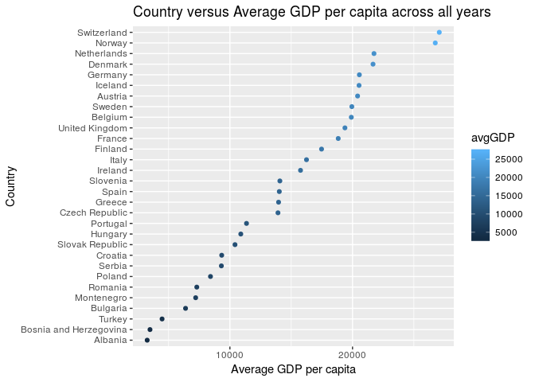

Gapminder-Exploration
================
Curtis Fox

-   [Factor Management](#factor-management)
-   [File I/O](#file-io)
-   [Visualization Design](#visualization-design)
-   [Writing Figures to a File](#writing-figures-to-a-file)

``` r
options(warn = -1) # supresses warnings
suppressPackageStartupMessages(library(tidyverse))
```

    ## Note: the specification for S3 class "difftime" in package 'lubridate' seems equivalent to one from package 'hms': not turning on duplicate class definitions for this class.

``` r
suppressPackageStartupMessages(library(gapminder))
suppressPackageStartupMessages(library(plotly))
```

``` r
library(gapminder)
library(tidyverse)
library(plotly)
```

Factor Management
-----------------

We first check the number of levels for the country and continent variables before filtering and dropping unused factor levels. We also check the number of rows the dataset has.

``` r
gapminder %>%
  str() 
```

    ## Classes 'tbl_df', 'tbl' and 'data.frame':    1704 obs. of  6 variables:
    ##  $ country  : Factor w/ 142 levels "Afghanistan",..: 1 1 1 1 1 1 1 1 1 1 ...
    ##  $ continent: Factor w/ 5 levels "Africa","Americas",..: 3 3 3 3 3 3 3 3 3 3 ...
    ##  $ year     : int  1952 1957 1962 1967 1972 1977 1982 1987 1992 1997 ...
    ##  $ lifeExp  : num  28.8 30.3 32 34 36.1 ...
    ##  $ pop      : int  8425333 9240934 10267083 11537966 13079460 14880372 12881816 13867957 16317921 22227415 ...
    ##  $ gdpPercap: num  779 821 853 836 740 ...

Now apply filtering and dropping of levels.

``` r
gapminder %>%
  filter(continent != "Oceania") %>% # remove rows with continent equal to Oceania
  droplevels() %>%
  str()
```

    ## Classes 'tbl_df', 'tbl' and 'data.frame':    1680 obs. of  6 variables:
    ##  $ country  : Factor w/ 140 levels "Afghanistan",..: 1 1 1 1 1 1 1 1 1 1 ...
    ##  $ continent: Factor w/ 4 levels "Africa","Americas",..: 3 3 3 3 3 3 3 3 3 3 ...
    ##  $ year     : int  1952 1957 1962 1967 1972 1977 1982 1987 1992 1997 ...
    ##  $ lifeExp  : num  28.8 30.3 32 34 36.1 ...
    ##  $ pop      : int  8425333 9240934 10267083 11537966 13079460 14880372 12881816 13867957 16317921 22227415 ...
    ##  $ gdpPercap: num  779 821 853 836 740 ...

The country factor went from 142 levels to 140 levels, the continent factor went from 5 levels to 4 levels (since we drop Oceania), and the number of rows went from 1704 to 1680.

Now we will experiment with reordering a factor. We first create a dataset where we filter out all values that don't have continent equal to Europe. We then group by country, and compute the mean GDP per capita across all years for each country. As you can see from the table and plots, the data is currently sorted alphabetically by country.

``` r
df <- gapminder %>%
   filter(continent == 'Europe') %>%
   group_by(country) %>%
   summarize(avgGDP = mean(gdpPercap)) 

knitr :: kable(df) # print table
```

| country                |     avgGDP|
|:-----------------------|----------:|
| Albania                |   3255.367|
| Austria                |  20411.916|
| Belgium                |  19900.758|
| Bosnia and Herzegovina |   3484.779|
| Bulgaria               |   6384.055|
| Croatia                |   9331.712|
| Czech Republic         |  13920.011|
| Denmark                |  21671.825|
| Finland                |  17473.723|
| France                 |  18833.570|
| Germany                |  20556.684|
| Greece                 |  13969.037|
| Hungary                |  10888.176|
| Iceland                |  20531.422|
| Ireland                |  15758.606|
| Italy                  |  16245.209|
| Montenegro             |   7208.065|
| Netherlands            |  21748.852|
| Norway                 |  26747.307|
| Poland                 |   8416.554|
| Portugal               |  11354.092|
| Romania                |   7300.170|
| Serbia                 |   9305.049|
| Slovak Republic        |  10415.531|
| Slovenia               |  14074.582|
| Spain                  |  14029.826|
| Sweden                 |  19943.126|
| Switzerland            |  27074.334|
| Turkey                 |   4469.453|
| United Kingdom         |  19380.473|

``` r
ggplot(df, aes(avgGDP, country, colour = avgGDP)) +
   geom_point() + 
   ggtitle("Country versus Average GDP per capita across all years") +
   xlab("Average GDP per capita") + 
   ylab("Country")
```


Now I will now reorder the country factor by mean GDP per capita, and produce a new plot.

``` r
df <- gapminder %>%
   filter(continent == 'Europe') %>%
   group_by(country) %>%
   summarize(avgGDP = mean(gdpPercap)) %>%
   mutate(country = fct_reorder(country, avgGDP)) # this line reorders the country factor by average GDP per capita

ggplot(df, aes(avgGDP, country, colour = avgGDP)) +
   geom_point() + 
   ggtitle("Country versus Average GDP per capita across all years") +
   xlab("Average GDP per capita") + 
   ylab("Country")
```



File I/O
--------

We create a dataset using gapminder, grouping by continent and getting the max life expectancy accross all years for each continent. We then order the continent factor by max life expectancy. We try using write\_csv and read\_csv, and see if factors are preserved (in addition to their ordering) after writing the dataset to a file with write\_csv, and then reading it back in with read\_csv.

First lets create our dataset, and view the continent factor, along with its level ordering.

``` r
gapminderExpMax <- gapminder %>%
  group_by(continent) %>%
  summarize(maxLifeExp = max(lifeExp)) %>%
  mutate(continent = fct_reorder(continent, maxLifeExp, .desc = TRUE)) # reorder continent factor by max life expectancy

gapminderExpMax %>%
  str()
```

    ## Classes 'tbl_df', 'tbl' and 'data.frame':    5 obs. of  2 variables:
    ##  $ continent : Factor w/ 5 levels "Asia","Europe",..: 5 4 1 2 3
    ##  $ maxLifeExp: num  76.4 80.7 82.6 81.8 81.2

Now lets read the dataset to a file and read it back in, and check the continent factor afterwords.

``` r
# Write dataset to file and read dataset back in
gapminderExpMax %>%
  write_csv("ModifiedDataset.csv")
modifiedDataset = read_csv("ModifiedDataset.csv")
```

    ## Parsed with column specification:
    ## cols(
    ##   continent = col_character(),
    ##   maxLifeExp = col_double()
    ## )

``` r
modifiedDataset %>%
  str()
```

    ## Classes 'tbl_df', 'tbl' and 'data.frame':    5 obs. of  2 variables:
    ##  $ continent : chr  "Africa" "Americas" "Asia" "Europe" ...
    ##  $ maxLifeExp: num  76.4 80.7 82.6 81.8 81.2
    ##  - attr(*, "spec")=List of 2
    ##   ..$ cols   :List of 2
    ##   .. ..$ continent : list()
    ##   .. .. ..- attr(*, "class")= chr  "collector_character" "collector"
    ##   .. ..$ maxLifeExp: list()
    ##   .. .. ..- attr(*, "class")= chr  "collector_double" "collector"
    ##   ..$ default: list()
    ##   .. ..- attr(*, "class")= chr  "collector_guess" "collector"
    ##   ..- attr(*, "class")= chr "col_spec"

As we can see, the new dataset no longer has continent as a factor, and the ordering of the continents also changed (the ordering is now alphabetical, rather than in descending order by max life expectancy) aftering writing and then reading the dataset back in.

We now try using RDS functions instead, using the same dataset as used for the csv functions. We will first use the saveRDS function to save the data to a file, and then we read the data back in using readRDS function. First let's see the ordering of the continent factor.

First view the continent factor, along with its level ordering.

``` r
gapminderExpMax %>%
  str()
```

    ## Classes 'tbl_df', 'tbl' and 'data.frame':    5 obs. of  2 variables:
    ##  $ continent : Factor w/ 5 levels "Asia","Europe",..: 5 4 1 2 3
    ##  $ maxLifeExp: num  76.4 80.7 82.6 81.8 81.2

Now lets read the dataset to a file and read it back in, and check the continent factor afterwords.

``` r
# Write dataset to file and read dataset back in
gapminderExpMax %>%
  saveRDS("ModifiedDataset.rds")
modifiedDataset = readRDS("ModifiedDataset.rds")
modifiedDataset %>%
  str()
```

    ## Classes 'tbl_df', 'tbl' and 'data.frame':    5 obs. of  2 variables:
    ##  $ continent : Factor w/ 5 levels "Asia","Europe",..: 5 4 1 2 3
    ##  $ maxLifeExp: num  76.4 80.7 82.6 81.8 81.2

We can see that by using the RDS functions, we were able to preserve all factors, as well as their ordering.

Visualization Design
--------------------

I first filter the dataset, removing all rows with year not equal to 2007, along with removing any rows with continent equal to Oceania. I then created a violin plot, showcasing the spread of populations in various continents in 2007. I added a colour scheme, as we learned in class. I also changed the size of the axis text, using "theme."

``` r
df <- gapminder %>%
  filter(year == 2007 & continent != 'Oceania') 
  
myPlot <- ggplot(df, aes(continent, pop, fill = continent)) +
  geom_violin() +
  scale_y_log10() + # scale y axis
  scale_fill_brewer(palette = "Set1") + # apply colour scheme
  ggtitle("Population Spread Comparison across Continents") +
  ylab("population")  + 
  theme(axis.text = element_text(size = 12)) # change size of axis text

myPlot # render actual plot
```


We now convert the graph above to a plotly plot. Note that to actually interact with the plot, one must do it in rstudio, and not through github. I've commented out the code that produces the plotly plot below, however feel free to uncomment it and run the code to interact with the plot.

``` r
# ggplotly(myPlot)  
```

Using plotly, I am able to hover over the plot and actually interact with it, which is not possible using ggplot. Mousing over the plot allows you to see data that isn't obvious by just looking at the plot.

Writing Figures to a File
-------------------------

In the next part, we again use the gapminder dataset. I first filter out all rows that don't have year 2007. I then create a scatterplot of life expectancy versus GDP per capita. The final step was saving the plot to a file, and then using the markdown syntax to render the saved plot in my markdown document. I play around with a few parameters of ggsave, such as making the plot larger.

``` r
df <- gapminder %>%
  filter(year == 2007) # keep only the rows with year == 2007
plot <- ggplot(df, aes(lifeExp, gdpPercap)) +
  geom_point() +
  xlab("Life Expectancy") +
  ylab("GDP per capita") +
  ggtitle("GDP per capita versus Life Expectancy")
ggsave("GDP-LifeExp-plot.png", plot, width = 8, height = 8, dpi = "retina") # save plot to file
```


